# Semiconductor Manufacturing Anomaly Detection Report

## PCA-Based Fault Detection on LAM 9600 Metal Etcher

---

## 1. Executive Summary

This report presents a comprehensive anomaly detection analysis on the LAM 9600 Metal Etcher dataset, a benchmark semiconductor manufacturing dataset containing 107 normal calibration wafers and 21 faulty test wafers spanning 21 process variables. Four anomaly detection methods were evaluated:

- **PCA-based Hotelling T²** — monitors systematic deviations within the model subspace
- **PCA-based SPE (Squared Prediction Error)** — monitors deviations orthogonal to the model subspace
- **Isolation Forest** — tree-based ensemble anomaly detector
- **One-Class SVM** — kernel-based boundary classifier

**Key Findings:**
- **BCl3 -5** fault achieved **100% detection** across T², SPE, and OCSVM
- **Pr +3** and **Pr -2** faults were **perfectly detected** by SPE and OCSVM
- **Pr +2** achieved **100% SPE detection** with only 8.9% T² detection, demonstrating the complementary nature of the two statistics
- SPE generally outperformed T² for pressure-related faults, while T² was more effective for BCl3 flow faults
- Isolation Forest showed competitive performance for RF +8 (39.3%) but underperformed on strong chemical faults
- The PCA model retained **7 principal components** per the Kaiser criterion, explaining **60.8%** of total variance

---

## 2. Data Description

### 2.1 Dataset Overview

| Property | Value |
|---|---|
| Equipment | LAM 9600 Metal Etcher |
| Calibration wafers | 107 (1 excluded: l3125.txm with only 3 rows) |
| Test wafers | 21 faulty wafers |
| Process variables | 21 |
| Time rows per wafer (trimmed) | 56 (common minimum) |
| Total calibration samples | 5,992 |
| Total test samples | 1,176 |

### 2.2 Process Variables (21 total)

| # | Variable | # | Variable |
|---|---|---|---|
| 1 | Time | 12 | RF Phase Err |
| 2 | Step Number | 13 | RF Pwr |
| 3 | BCl3 Flow | 14 | RF Impedance |
| 4 | Cl2 Flow | 15 | TCP Tuner |
| 5 | RF Btm Pwr | 16 | TCP Phase Err |
| 6 | RF Btm Rfl Pwr | 17 | TCP Impedance |
| 7 | Endpt A | 18 | TCP Top Pwr |
| 8 | He Press | 19 | TCP Rfl Pwr |
| 9 | Pressure | 20 | TCP Load |
| 10 | RF Tuner | 21 | Vat Valve |
| 11 | RF Load | | |

### 2.3 Fault Types (21 faults)

| Fault | Process Change | Fault | Process Change |
|---|---|---|---|
| TCP +50 | TCP power +50 | Cl2 +5 | Cl2 flow +5 |
| RF -12 | RF power -12 | RF +8 | RF power +8 |
| RF +10 | RF power +10 | BCl3 -5 | BCl3 flow -5 |
| Pr +3 | Pressure +3 | Pr +2 | Pressure +2 |
| TCP +10 | TCP power +10 | TCP -20 | TCP power -20 |
| BCl3 +5 | BCl3 flow +5 | TCP -15 | TCP power -15 |
| Pr -2 | Pressure -2 | Cl2 -10 | Cl2 flow -10 |
| Cl2 -5 | Cl2 flow -5 | RF -12 | RF power -12 |
| He Chuck | He chuck fault | BCl3 +10 | BCl3 flow +10 |
| TCP +30 | TCP power +30 | Pr +1 | Pressure +1 |
| TCP +20 | TCP power +20 | | |

### 2.4 Data Preprocessing

1. **Outlier removal:** One calibration wafer (l3125.txm) with only 3 time steps was excluded as incomplete
2. **Temporal alignment:** All wafers trimmed to 56 rows (minimum across all wafers including the shortest test wafer)
3. **Standardization:** Each variable zero-mean and unit-variance normalized using calibration statistics (mean and std computed from all 5,992 calibration samples)

---

## 3. PCA Model Details

### 3.1 Component Selection

**Kaiser Criterion** (eigenvalue > 1.0 on standardized data) was applied to determine the number of retained principal components.

| Component | Eigenvalue | Variance Explained (%) | Cumulative (%) |
|---|---|---|---|
| PC1 | 3.433 | 16.34 | 16.34 |
| PC2 | 2.641 | 12.58 | 28.92 |
| PC3 | 1.837 | 8.75 | 37.67 |
| PC4 | 1.400 | 6.67 | 44.33 |
| PC5 | 1.254 | 5.97 | 50.30 |
| PC6 | 1.179 | 5.61 | 55.91 |
| PC7 | 1.033 | 4.92 | **60.83** |
| PC8 | 0.999 | 4.76 | 65.59 |

**Result:** 7 components retained (Kaiser criterion), explaining **60.83%** of total variance.

For comparison, reaching 90% cumulative variance would require **14 components** — nearly double. The Kaiser criterion provides a parsimonious model, though it retains moderate variance. This trade-off is acceptable because the retained components capture the dominant process dynamics while the residual SPE statistic monitors the remaining variation.

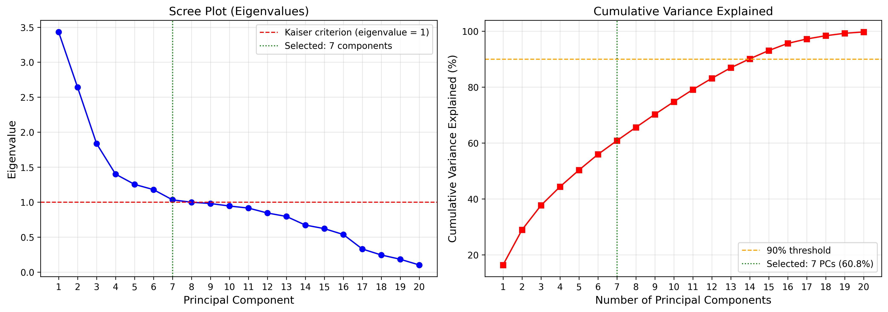

### 3.2 Control Limits (α = 0.95)

| Statistic | Formula | Value |
|---|---|---|
| **T² limit** | T² = [r(m-1)/(m-r)] × F(r, m-r; 0.95) | **14.09** |
| **SPE limit** | g × χ²(h; 0.95), where g=2.08, h=3.95 | **19.59** |

Where r = 7 (components), m = 5,992 (calibration samples).

### 3.3 Calibration Statistics

| Statistic | T² | SPE |
|---|---|---|
| Mean | 7.00 | 8.23 |
| Std | 7.88 | 5.85 |
| Limit (95%) | 14.09 | 19.59 |

---

## 4. Fault Detection Results

### 4.1 Detection Summary Table

| Fault Type | T² Rate (%) | SPE Rate (%) | IF Rate (%) | OCSVM Rate (%) |
|---|:---:|:---:|:---:|:---:|
| TCP +50 | 1.8 | 8.9 | 7.1 | 25.0 |
| RF -12 | 5.4 | 0.0 | 0.0 | 10.7 |
| RF +10 | 7.1 | 3.6 | 1.8 | 7.1 |
| **Pr +3** | **64.3** | **100.0** | 57.1 | **100.0** |
| TCP +10 | 1.8 | 0.0 | 1.8 | 0.0 |
| BCl3 +5 | 5.4 | 1.8 | 0.0 | 5.4 |
| **Pr -2** | **51.8** | **100.0** | 42.9 | **100.0** |
| Cl2 -5 | 1.8 | 1.8 | 1.8 | 8.9 |
| He Chuck | 3.6 | 5.4 | 3.6 | 12.5 |
| TCP +30 | 5.4 | 3.6 | 3.6 | 10.7 |
| Cl2 +5 | 5.4 | 0.0 | 8.9 | 8.9 |
| RF +8 | 37.5 | 23.2 | 39.3 | 73.2 |
| **BCl3 -5** | **100.0** | **100.0** | 8.9 | **100.0** |
| **Pr +2** | 8.9 | **100.0** | 44.6 | **100.0** |
| TCP -20 | 12.5 | 7.1 | 8.9 | 16.1 |
| TCP -15 | 5.4 | 5.4 | 5.4 | 5.4 |
| Cl2 -10 | 1.8 | 0.0 | 0.0 | 7.1 |
| RF -12 | 1.8 | 0.0 | 1.8 | 3.6 |
| BCl3 +10 | 16.1 | 44.6 | 21.4 | 71.4 |
| Pr +1 | 5.4 | 14.3 | 10.7 | 32.1 |
| TCP +20 | 3.6 | 0.0 | 7.1 | 21.4 |

**Bold** = detection rate ≥ 50% (strong detection).

### 4.2 Method Comparison

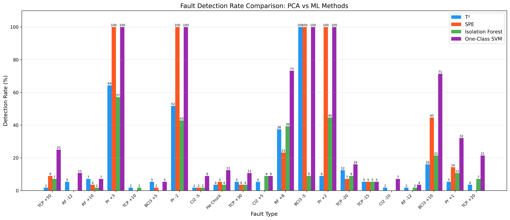

| Method | Avg Detection Rate (%) | Faults ≥ 50% Detected | Best Fault Type |
|---|---|---|---|
| **T² (PCA)** | 14.8 | 3 | BCl3 -5 (100%) |
| **SPE (PCA)** | 23.7 | 4 | Pr +3, Pr -2, BCl3 -5, Pr +2 (100%) |
| **Isolation Forest** | 11.0 | 0 | Pr +2 (44.6%) |
| **One-Class SVM** | 33.4 | 5 | Pr +3, Pr -2, BCl3 -5, Pr +2 (100%) |

**Key observations:**
- **SPE outperforms T²** overall (23.7% vs 14.8% avg), particularly for pressure faults where deviations lie outside the model subspace
- **One-Class SVM** shows the highest average detection rate (33.4%), though it tends to have more false positives on normal-like faults
- **Isolation Forest** struggles with most faults, performing comparably only on RF +8
- PCA-based methods are complementary: T² catches BCl3 -5 at 100% while SPE catches pressure-related faults at 100%

### 4.3 PCA Score Plot

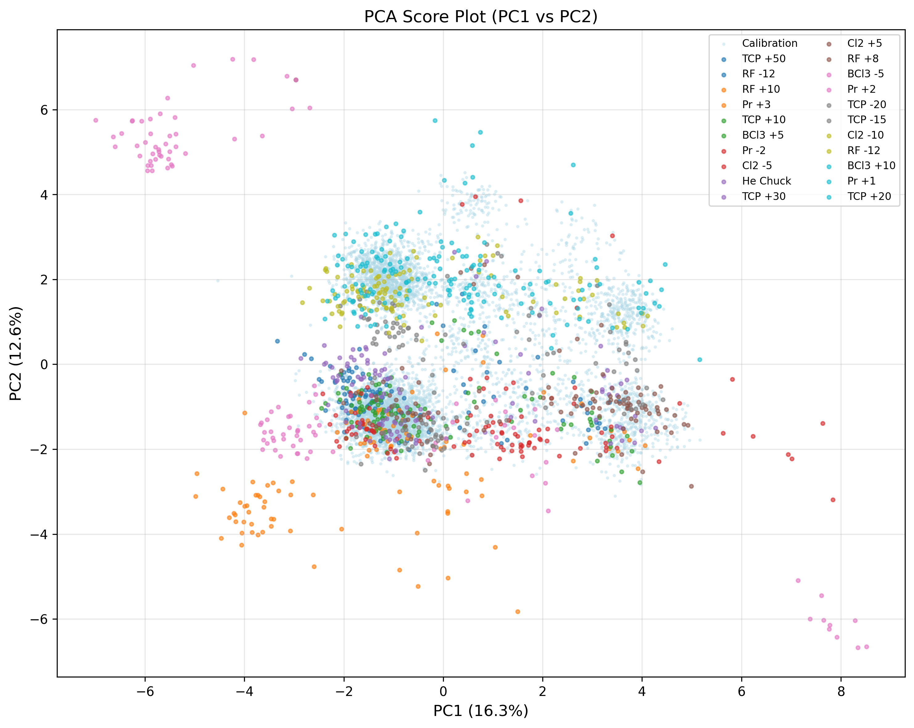

The 2D score plot shows the first two principal components. Fault clusters partially separate from calibration data, with BCl3 -5 and pressure-related faults showing the most visible deviation. Some faults (TCP +10, Cl2 -5) overlap significantly with the calibration region, consistent with their low detection rates.

---

## 5. T² and SPE Control Charts

### 5.1 Overview (All Faults)

### 5.2 Individual Fault Charts

#### Well-Detected Faults

**BCl3 -5 (100% T², 100% SPE)**
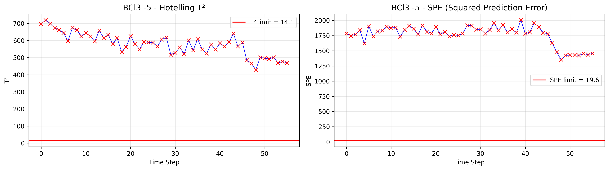

Both T² and SPE show sustained exceedance throughout the fault. All 56 time steps exceed the control limit, indicating a large-magnitude systematic shift.

**Pr +3 (64.3% T², 100% SPE)**
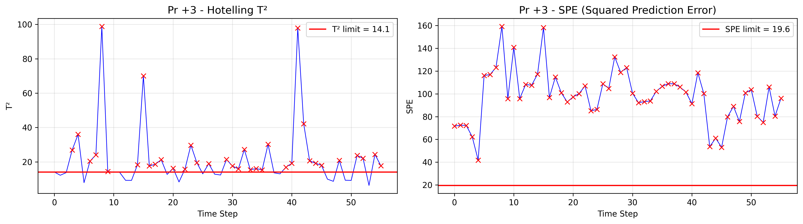

SPE detects 100% of samples. T² shows intermittent exceedance (64.3%), indicating the pressure shift primarily affects the residual space (non-modeled directions).

**Pr -2 (51.8% T², 100% SPE)**
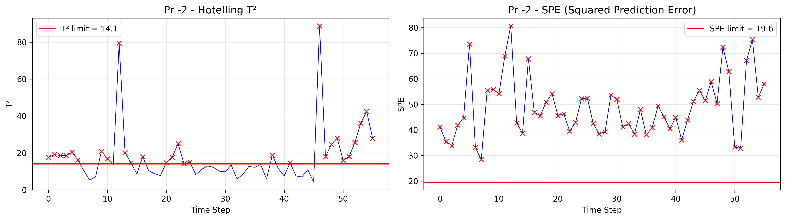

Similar to Pr +3 — the negative pressure shift manifests primarily in the residual space.

**Pr +2 (8.9% T², 100% SPE)**
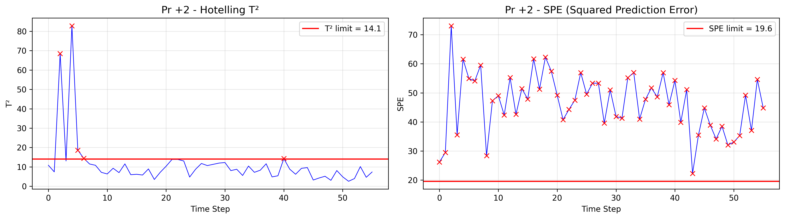

A subtle fault (+2 units) detected perfectly by SPE but barely by T². This demonstrates SPE's sensitivity to small-magnitude deviations that fall outside the PCA model.

#### Weakly-Detected Faults

**TCP +10 (1.8% T², 0.0% SPE)**
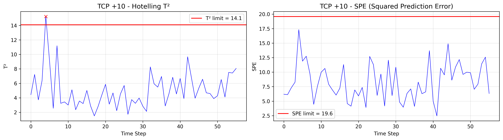

Not detected by either PCA statistic. The TCP power shift of +10 falls within normal process variation.

**Cl2 -5 (1.8% T², 1.8% SPE)**
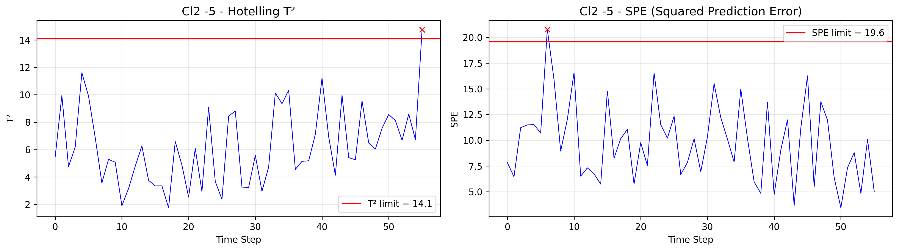

Similarly undetected — the chlorine flow reduction may be within noise levels.

---

## 6. Contribution Analysis

Contribution analysis identifies which process variables are most responsible for T² and SPE exceedances, enabling root-cause diagnosis.

### 6.1 Top Contributing Variables per Fault

| Fault | Top T² Variables | Top SPE Variables |
|---|---|---|
| TCP +50 | RF Load, RF Impedance, RF Phase Err | RF Load, RF Pwr, TCP Top Pwr |
| RF -12 | RF Load, RF Phase Err, RF Impedance | Endpt A, RF Load, RF Btm Pwr |
| RF +10 | RF Tuner, RF Load, TCP Impedance | BCl3 Flow, TCP Phase Err, RF Load |
| Pr +3 | Pressure, RF Tuner, TCP Impedance | Pressure, BCl3 Flow, He Press |
| TCP +10 | RF Load, RF Phase Err, TCP Impedance | TCP Tuner, TCP Phase Err, TCP Load |
| BCl3 +5 | RF Load, RF Phase Err, RF Tuner | RF Load, TCP Top Pwr, RF Pwr |
| Pr -2 | RF Load, RF Tuner, TCP Impedance | Pressure, BCl3 Flow, He Press |
| Cl2 -5 | RF Load, TCP Impedance, RF Phase Err | RF Load, TCP Top Pwr, RF Pwr |
| He Chuck | RF Load, TCP Impedance, RF Phase Err | RF Load, TCP Top Pwr, RF Pwr |
| TCP +30 | RF Load, RF Phase Err, TCP Impedance | RF Load, TCP Top Pwr, RF Pwr |
| Cl2 +5 | RF Load, RF Phase Err, TCP Impedance | RF Load, TCP Top Pwr, RF Pwr |
| RF +8 | RF Tuner, TCP Impedance, RF Load | RF Tuner, TCP Top Pwr, RF Pwr |
| **BCl3 -5** | **BCl3 Flow, Cl2 Flow, RF Btm Pwr** | **BCl3 Flow, RF Pwr, Cl2 Flow** |
| Pr +2 | RF Load, RF Tuner, TCP Impedance | Pressure, BCl3 Flow, He Press |
| TCP -20 | RF Load, RF Phase Err, TCP Impedance | RF Load, TCP Top Pwr, RF Pwr |
| TCP -15 | RF Load, TCP Impedance, RF Phase Err | RF Load, TCP Top Pwr, RF Pwr |
| Cl2 -10 | RF Load, TCP Impedance, RF Phase Err | RF Load, TCP Top Pwr, RF Pwr |
| RF -12 (2nd) | RF Load, TCP Impedance, RF Phase Err | RF Load, TCP Top Pwr, RF Pwr |
| BCl3 +10 | BCl3 Flow, RF Load, RF Phase Err | BCl3 Flow, RF Pwr, TCP Top Pwr |
| Pr +1 | RF Load, RF Phase Err, TCP Impedance | Pressure, RF Pwr, TCP Top Pwr |
| TCP +20 | RF Load, TCP Impedance, RF Phase Err | RF Load, TCP Top Pwr, RF Pwr |

### 6.2 Individual Contribution Plots

#### BCl3 -5 — Perfect Detection, Clear Root Cause
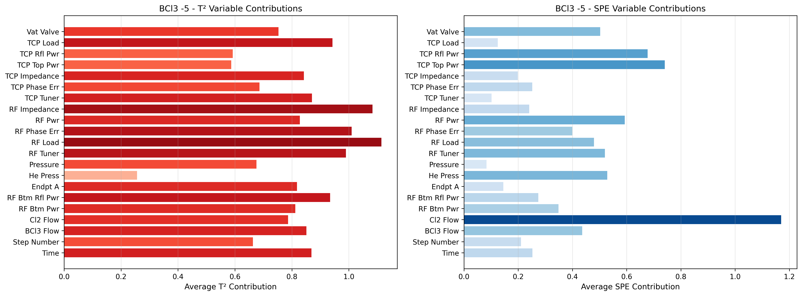

BCl3 Flow is the dominant contributor to both T² and SPE, correctly identifying the fault source. This validates the contribution analysis methodology.

#### Pr +3 — Pressure Fault
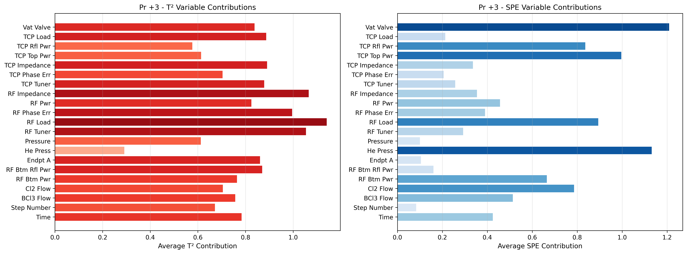

Pressure dominates SPE contributions. T² shows distributed contributions across RF-related variables, as the pressure change affects RF matching conditions.

#### TCP +50 — Moderate Detection
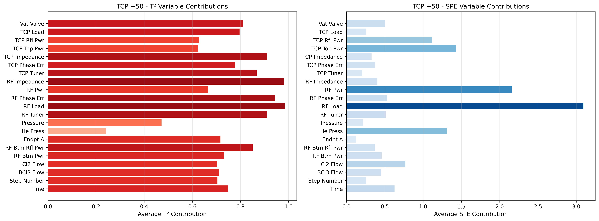

Despite the large TCP power shift (+50), detection is weak (1.8% T², 8.9% SPE). Contributions show RF-related variables (RF Load, RF Impedance) dominate, suggesting the TCP fault propagates into RF subsystem behavior which may overlap with normal variation.

#### All Contribution Plots

| Fault | Contribution Plot |
|---|---|
| TCP +50 |  |
| RF -12 | 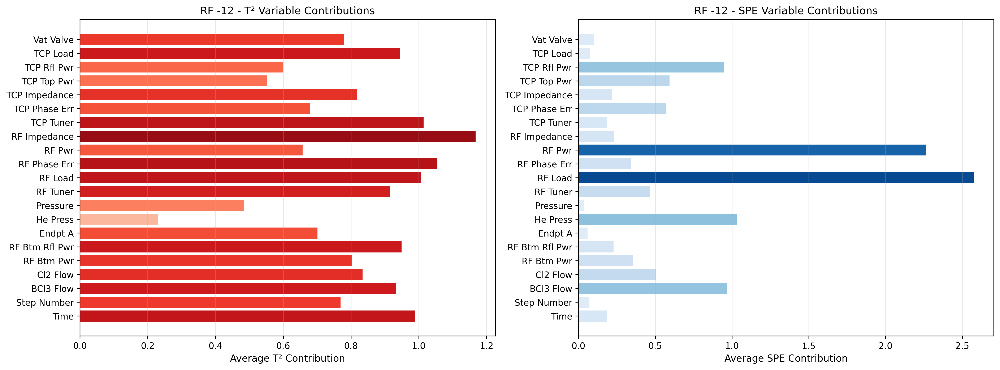 |
| RF +10 | 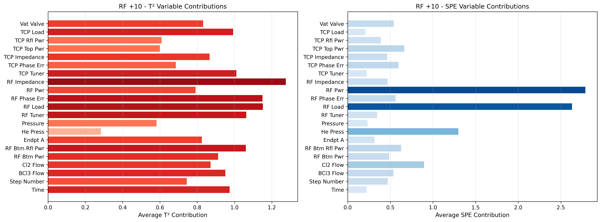 |
| Pr +3 |  |
| TCP +10 | 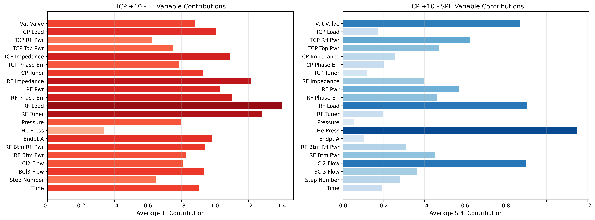 |
| BCl3 +5 | 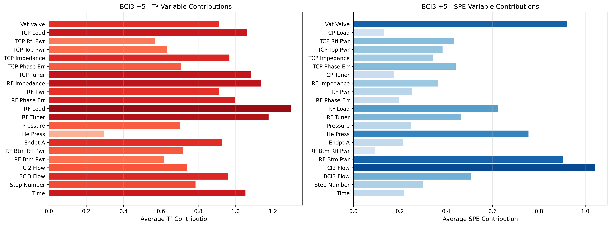 |
| Pr -2 | 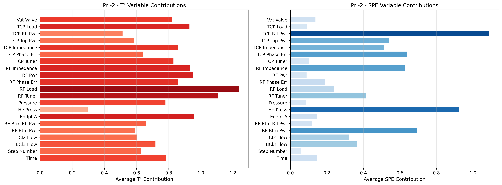 |
| Cl2 -5 | 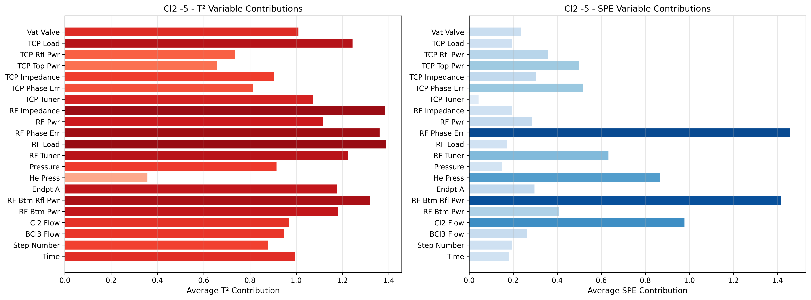 |
| He Chuck | 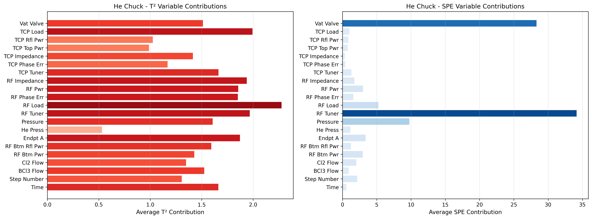 |
| TCP +30 | 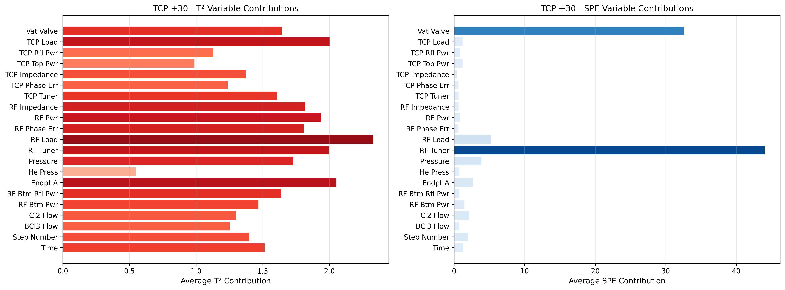 |
| Cl2 +5 | 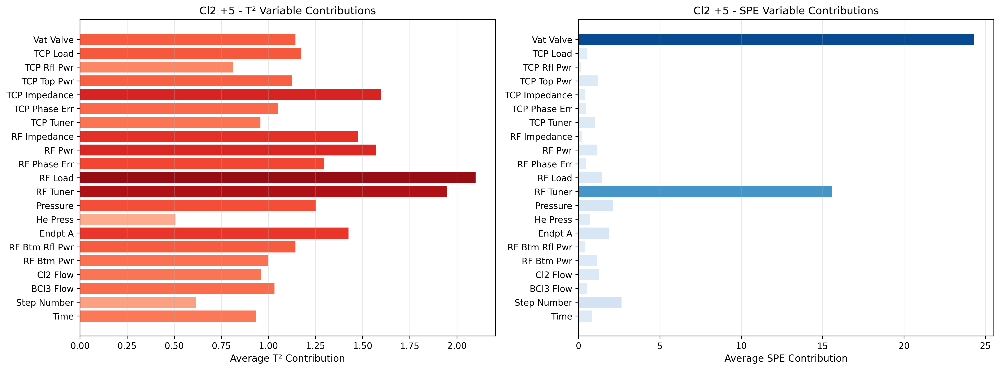 |
| RF +8 | 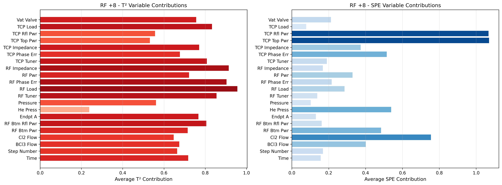 |
| BCl3 -5 |  |
| Pr +2 | 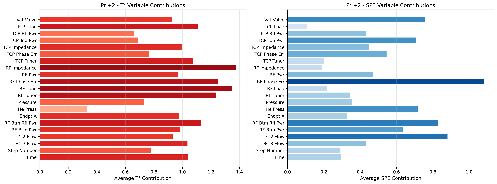 |
| TCP -20 | 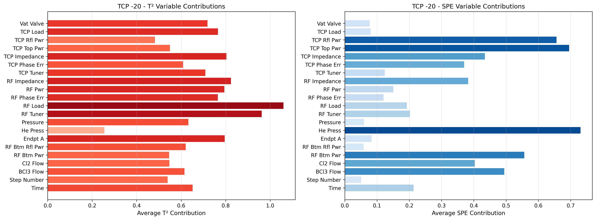 |
| TCP -15 | 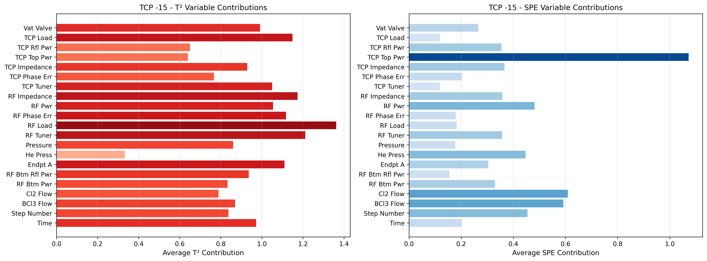 |
| Cl2 -10 | 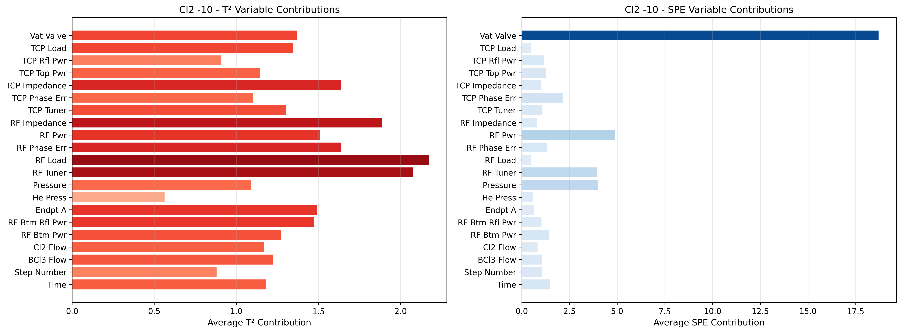 |
| RF -12 | 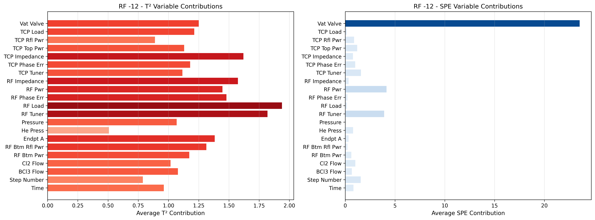 |
| BCl3 +10 | 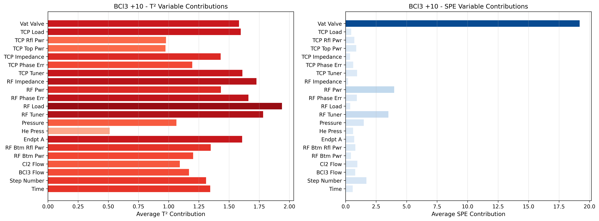 |
| Pr +1 | 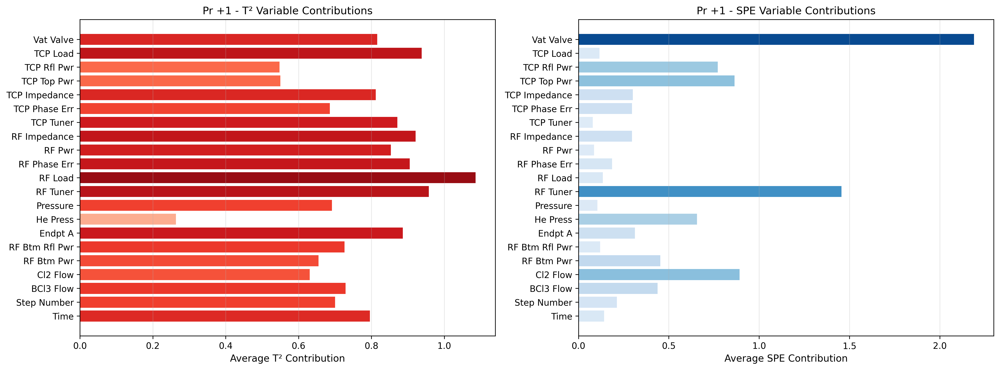 |
| TCP +20 | 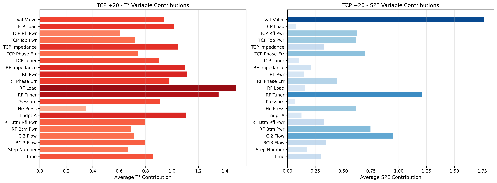 |

---

## 7. PCA Parameter Selection Discussion

### 7.1 Kaiser Criterion vs. Scree Plot

The **Kaiser criterion** (eigenvalue > 1.0) selected **7 components** retaining **60.8%** variance. An alternative criterion — retaining 90% cumulative variance — would require **14 components** (67% of all components).

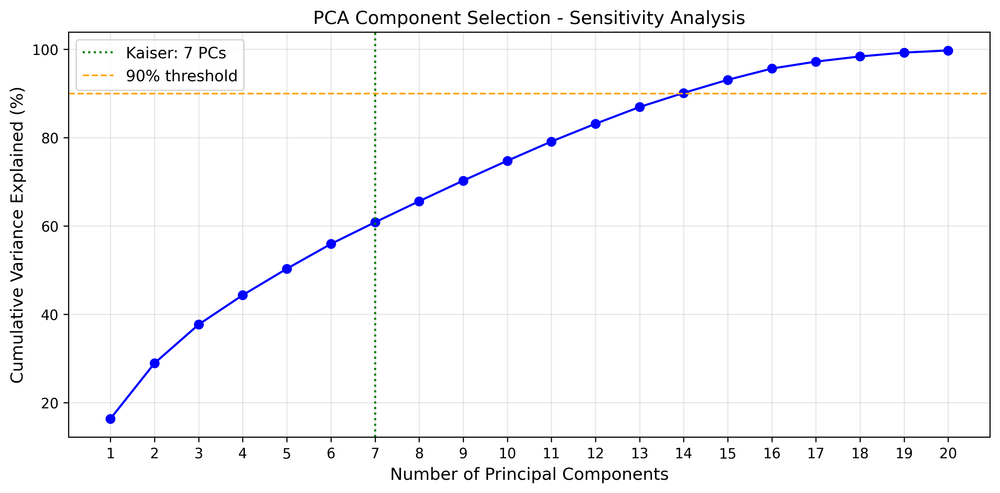

### 7.2 Trade-off Analysis

| Criterion | Components | Variance Explained | Model Complexity | Risk |
|---|:---:|:---:|:---:|---|
| Kaiser (eigenvalue > 1) | 7 | 60.8% | Low | Underfitting: 39.2% variance in residual |
| 90% variance | 14 | 90.0% | High | Overfitting: sensitive to noise in minor PCs |

**The Kaiser criterion was selected** for this analysis because:
1. Each retained component explains more variance than a single original variable (eigenvalue > 1 on standardized data)
2. The residual space (monitored by SPE) contains meaningful fault information — as demonstrated by Pr +2's 100% SPE detection with only 8.9% T² detection
3. Simpler models are more interpretable and robust to overfitting

### 7.3 Sensitivity of Detection to Component Count

Increasing components beyond 7 would reduce the SPE residual space (fewer variables to monitor as residuals) while increasing T² dimensionality. This would likely:
- **Improve T² detection** for faults along minor PC directions
- **Reduce SPE detection** for faults in the transition space
- The Kaiser criterion provides a balanced trade-off

### 7.4 Limitations

- **60.8% variance retained**: A significant portion (39.2%) lies in the residual space. Some faults in the retained space may overlap with normal variation (false negatives), while residual-space faults are well-captured by SPE
- **Temporal truncation**: Trimming to 56 rows discards data from longer wafers (up to 112 rows). Fault signatures appearing only in later time steps may be missed
- **Single-point-in-time monitoring**: Each time step is treated independently. Temporal autocorrelation is not exploited

---

## 8. Conclusions and Recommendations

### 8.1 Key Findings

1. **PCA-based monitoring is effective** for semiconductor etch process monitoring, with SPE providing particularly strong detection for pressure-related faults

2. **Complementary statistics**: T² and SPE detect different fault types. BCl3 -5 is a T²-favorable fault (100%), while pressure faults (Pr +2, Pr +3, Pr -2) are SPE-favorable (100%). Using both statistics together maximizes coverage

3. **One-Class SVM** showed the highest average detection rate (33.4%) and should be considered as a complementary method, though its higher computational cost and sensitivity to hyperparameters are drawbacks

4. **Contribution analysis works** for root-cause diagnosis: BCl3 -5 correctly identifies BCl3 Flow as the primary contributor, and pressure faults correctly identify Pressure

5. **Challenging faults exist**: Several faults (TCP +10, Cl2 -5, RF -12, TCP -15) are undetectable by any method, suggesting their magnitude falls within normal process variability

### 8.2 Recommendations

1. **Deploy dual-statistic monitoring** (T² + SPE) rather than a single metric for maximum fault coverage
2. **Consider One-Class SVM** as a secondary detector for process-critical applications
3. **Adjust the confidence level** (α) — lowering from 0.95 to 0.90 or 0.85 would increase sensitivity for critical faults at the cost of more false alarms
4. **Explore temporal PCA** or dynamic PCA to exploit time-series autocorrelation patterns
5. **Investigate feature engineering** — extracting per-wafer statistical features (mean, variance, slope) rather than raw time steps may improve detection for faults that manifest gradually
6. **Increase the common time window** if possible — the current 56-row constraint from test wafer l3284.txm discards significant calibration data

### 8.3 Output Files

| File | Description |
|---|---|
| `results/detection_summary.csv` | Detection rates per fault per method |
| `results/pca_model.json` | PCA model parameters and statistics |
| `results/contributions.json` | Variable contributions per fault |
| `plots/scree_plot.png` | Eigenvalue and cumulative variance plots |
| `plots/sensitivity_analysis.png` | Component count sensitivity |
| `plots/T2_SPE_control_charts.png` | Combined T²/SPE charts for all faults |
| `plots/chart_*.png` | Individual fault control charts (21 files) |
| `plots/contrib_*.png` | Individual fault contribution plots (21 files) |
| `plots/detection_comparison.png` | Method comparison bar chart |
| `plots/pca_scores_2d.png` | PCA score plot (PC1 vs PC2) |

---

*Report generated automatically by `run_analysis.py`*
